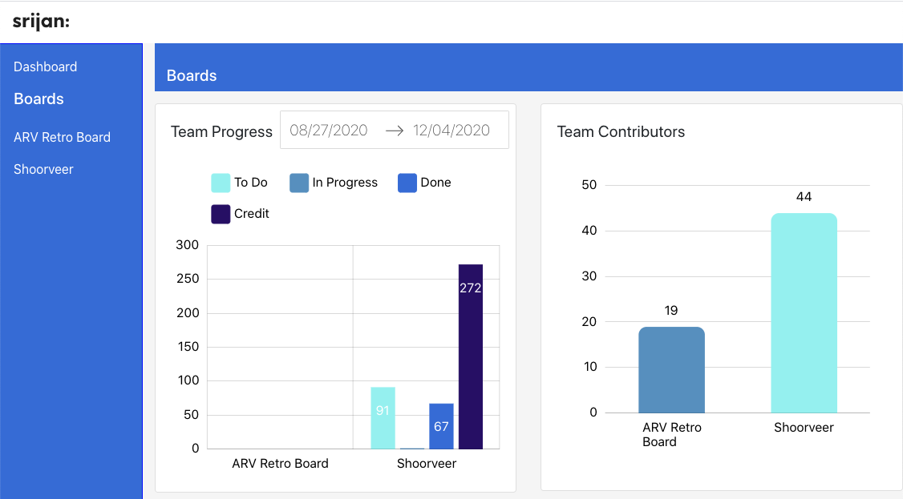

# Trello-Board

- Trello helps teams work more collaboratively and get more done.
- Trello’s boards, lists, and cards enable teams to organize and prioritize projects in a fun, flexible, and rewarding way.
- Whether it’s for work, a side project or even the next family vacation, Trello helps your team stay organized.

## Objective (NPM Module)
- This is Trello board application which will expose your trello-board data in different charts and will help you to check data for different projects
- Trello-board has nice visualization of charts to show data from trello-apis to visualization charts for mltiple projects in oraganization

### Installation 

```
npm install -g trello-board
```

### Running this Module
- Collect api key and token from Trello platform so this npm module can fetch data from provided Trello account and visualize it
- This package only doing read operation against the trello-data and showing them in different charts 
```
trello-board  --apikey=XXXXX --apitoken=XXXXX
```
### runtime of application
```
trello-board  --apikey=XXXXXXX --apitoken=XXXXXXXXX
info:  {"0":"Sample app listening on {\"address\":\"::\",\"family\":\"IPv6\",\"port\":8089}","timestamp":"2020-11-27 13:59:58"}
open browser on port 8089 
```
### Application on PORT 8089




